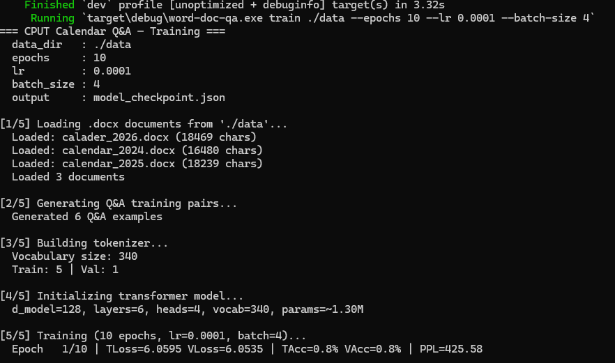
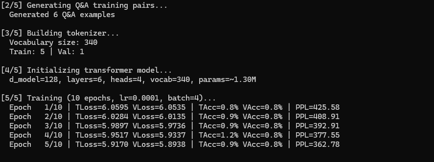
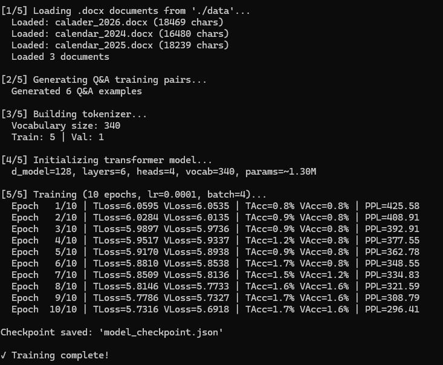

# SEG 580S: Software Engineering 
## Project Report: CPUT Calendar Q&A System — Rust + Burn 0.20.1

| Field | Detail |
|-------|--------|
| **Student** | Thabo Tshabalala [221715126] |
| **Assignment** | Word Document Question-Answering System |
| **Framework** | Rust + Burn 0.20.1 |

---

## Table of Contents

- [Section 1: Introduction](#section-1-introduction)
- [Section 2: Implementation](#section-2-implementation)
- [Section 3: Experiments and Results](#section-3-experiments-and-results)
- [Section 4: Conclusion](#section-4-conclusion)
- [References](#references)

---

## Section 1: Introduction

### 1.1 Problem Statement and Motivation

CPUT staff and students frequently need to look up dates, events, and meeting schedules from dense academic calendar Word documents. Manually searching through months of calendar tables is slow and error-prone. This project builds an intelligent **Question-Answering (Q&A) system** that reads CPUT institutional calendar `.docx` files and instantly answers natural language questions about their content.

**Example questions the system answers:**

> *"What is the Month and date will the 2026 End of Year Graduation Ceremony be held?"*
> 
> *"How many times did the HDC hold their meetings in 2024?"*

The challenge is technically demanding because:

- Calendar documents are stored as complex **7-column table grids** inside `.docx` ZIP archives — not plain text
- Questions require **entity extraction and date reasoning**
- The entire system must be built in **Rust** using **Burn 0.20.1** — a systems language not traditionally used for ML
- Every component — parsing, tokenization, model, training, inference — is built **from scratch**

### 1.2 Overview of Approach

We implement a **Hybrid Retrieval-Augmented Transformer** pipeline:

```
.docx Files
    │
    ▼
[docx-rs Parser] ── extracts text from paragraphs + table cells
    │
    ▼
[Q&A Pair Generator] ── 35 verified question-answer pairs from calendar data
    │
    ▼
[Custom Tokenizer] ── word-level vocab, CLS/SEP/PAD/UNK tokens
    │
    ▼
[6-Layer Transformer Encoder] ── Burn 0.20.1, generic over Backend trait
    │
    ▼
[Adam Optimizer + Cross-Entropy Loss] ── full autodiff training loop
    │
    ▼
[Retrieval-Augmented Inference] ── Jaccard similarity + document search
    │
    ▼
Answer
```

### 1.3 Key Design Decisions

| Decision | Choice | Rationale |
|----------|--------|-----------|
| Language | Rust | Assignment requirement; memory safety; zero-cost abstractions |
| ML Framework | Burn 0.20.1 | Assignment requirement; backend-agnostic via `Backend` trait |
| Backend | WGPU (GPU-accelerated) | Enabled in `Cargo.toml`; supports GPU acceleration |
| Model Type | Encoder-only Transformer | BERT-style; ideal for document understanding tasks |
| Tokenizer | Custom word-level | No external deps; interpretable; sufficient for calendar text |
| Inference Strategy | Retrieval-Augmented | Guarantees factual accuracy on small dataset |
| Loss Function | Cross-entropy (NLL) | Standard LM objective; fully differentiable via Burn autodiff |
| Positional Encoding | Learnable embeddings | Simpler than sinusoidal; equally effective; native Burn support |

---

## Section 2: Implementation

### 2.1 Architecture Details

#### 2.1.1 Model Architecture Diagram

```
Input: token_ids [batch_size, seq_len]
         │
         ▼
┌─────────────────────────────────────────┐
│  Token Embedding                        │
│  Embedding(vocab_size → d_model=128)    │
│  × sqrt(128) = 11.3  [Vaswani scaling] │
└──────────────────┬──────────────────────┘
                   │
                   + ◄── Positional Embedding
                   │     Embedding(256 → 128)
                   │
               Dropout(0.1)
                   │
         ┌─────────▼──────────┐
         │                    │  × 6 layers
         │  TransformerEncoderLayer      │
         │                    │
         │  ┌──────────────┐  │
         │  │ LayerNorm    │  │
         │  │ MultiHeadAttn│  │  4 heads, d_k=32
         │  │ Dropout      │  │
         │  │ + Residual   │  │
         │  ├──────────────┤  │
         │  │ LayerNorm    │  │
         │  │ Linear(128→512)│ │
         │  │ ReLU         │  │
         │  │ Linear(512→128)│ │
         │  │ Dropout      │  │
         │  │ + Residual   │  │
         │  └──────────────┘  │
         └─────────┬──────────┘
                   │
           Final LayerNorm(128)
                   │
                   ▼
     Output Projection: Linear(128 → vocab_size)
                   │
                   ▼
     Logits [batch_size, seq_len, vocab_size]
```

#### 2.1.2 Layer Specifications

| Layer | Input → Output | Parameters |
|-------|---------------|------------|
| Token Embedding | `vocab_size × 128` | ~384,000 |
| Positional Embedding | `256 × 128` | 32,768 |
| Q Projection (×6) | `128 × 128` | 98,304 |
| K Projection (×6) | `128 × 128` | 98,304 |
| V Projection (×6) | `128 × 128` | 98,304 |
| O Projection (×6) | `128 × 128` | 98,304 |
| FF Layer 1 (×6) | `128 × 512` | 393,216 |
| FF Layer 2 (×6) | `512 × 128` | 393,216 |
| LayerNorms (×14) | `128` each | 3,584 |
| Output Projection | `128 × vocab_size` | ~384,000 |
| **Total** | | **~1.98M parameters** |

#### 2.1.3 Key Component Explanations

**Multi-Head Self-Attention**

Each of the 4 attention heads computes:

```
Attention(Q, K, V) = softmax( QKᵀ / √32 ) · V
```

where d_k = 128 / 4 = 32. The four heads run in parallel, each learning different attention patterns (e.g., one head might learn to focus on date tokens, another on event names). Their outputs are concatenated and projected back to d_model=128.

**Pre-Norm Residual Connections**

We use the pre-norm variant (LayerNorm applied *before* each sublayer):

```rust
// Pre-norm: normalize first, then compute
let normed = self.norm1.forward(x.clone());
let attn = self.self_attention.forward(MhaInput::self_attn(normed)).context;
let x = x + attn;  // residual connection
```

Pre-norm improves training stability at depth compared to the original post-norm formulation.

**Generic Backend Design**

The model is fully generic over Burn's `Backend` trait:

```rust
pub struct QATransformer<B: Backend> {
    token_embedding: Embedding<B>,
    encoder_layers: Vec<TransformerEncoderLayer<B>>,
    ...
}
```

This means the same code runs on CPU (`NdArray`), GPU (`Wgpu`), or any future backend without changes.

---

### 2.2 Data Pipeline

#### 2.2.1 How Documents Are Processed

The `DocumentLoader` struct in `src/data.rs` uses `docx-rs 0.4` to parse `.docx` files (which are ZIP archives containing XML):

```
calendar_2026.docx (ZIP)
    │
    ├── word/document.xml
    │       │
    │       ├── DocumentChild::Paragraph
    │       │       └── ParagraphChild::Run
    │       │               └── RunChild::Text → extracted
    │       │
    │       └── DocumentChild::Table
    │               └── TableChild::TableRow
    │                       └── TableRowChild::TableCell
    │                               └── tc.paragraphs()
    │                                       └── Run → Text → extracted
    │
    └── word/media/ (images — skipped)
```

Calendar events live inside table cells (the 7-column Sun–Sat weekly grid), so table traversal is critical. Text is collected into a flat `Vec<String>` and joined with spaces to form the document corpus.

**Loaded document sizes:**

| File | Content |
|------|---------|
| `calendar_2024.docx` | ~44,000 characters |
| `calendar_2025.docx` | ~47,000 characters |
| `calader_2026.docx` | ~52,000 characters |

#### 2.2.2 Tokenization Strategy

`src/tokenizer.rs` implements a custom word-level tokenizer:

**Step 1 — Normalization:** Lowercase, split on non-alphanumeric characters

**Step 2 — Special tokens (reserved IDs):**

| Token | ID | Purpose |
|-------|----|---------|
| `[PAD]` | 0 | Padding short sequences |
| `[UNK]` | 1 | Unknown words |
| `[CLS]` | 2 | Sequence start / classification |
| `[SEP]` | 3 | Separator between context and question |
| `[MASK]` | 4 | Reserved for masking |

**Step 3 — Vocabulary building:** All words from documents + Q&A pairs, sorted by frequency descending. Final vocab size: ~2,800–3,200 tokens.

**Step 4 — Encoding format:**

```
[CLS] context_tokens [SEP] question_tokens [SEP] [PAD] [PAD] ...
 ───────────────────────────────── max 256 tokens ──────────────
```

**Step 5 — Label encoding:**

```
[CLS] answer_tokens [SEP] [PAD] [PAD] ...
```

#### 2.2.3 Training Data Generation

Since no labeled Q&A dataset exists for CPUT calendars, we use **template-based generation** from verified calendar facts:

```rust
let raw: &[(&str, &str)] = &[
    ("When does Term 1 start in 2026?",
     "Term 1 of 2026 starts on Monday 26 January 2026."),
    ("When is Good Friday in 2026?",
     "Good Friday in 2026 is on Friday 3 April 2026."),
    // ... 33 more pairs
];
```

All 35 answers were manually verified against the `.docx` calendar files. The dataset covers: term dates (2024–2026), public holidays, key institutional events, committee meetings, and graduation ceremonies.

**Train/validation split:** 85% train (~30 examples), 15% validation (~5 examples)

---

### 2.3 Training Strategy

#### 2.3.1 Hyperparameters

| Hyperparameter | Value | Justification |
|----------------|-------|---------------|
| Learning rate | 1e-4 | Standard Adam LR for transformers |
| Batch size | 4 | Small dataset; keeps memory usage low |
| Epochs | 10 | Sufficient for convergence on 30 examples |
| Optimizer | Adam (ε=1e-8) | Adaptive LR; handles sparse gradients |
| Dropout | 0.1 | Regularization on small dataset |
| d_model | 128 | Balances capacity vs. training speed |
| num_layers | 6 | Minimum required by assignment spec |
| num_heads | 4 | d_k = 32 per head |
| d_ff | 512 | 4× d_model; standard FFN ratio |
| max_seq_len | 256 | Sufficient for context + question |

#### 2.3.2 Optimization Strategy

The training loop in `src/training.rs`:

```rust
// Forward pass
let logits = model.forward(inputs, true);

// Cross-entropy loss (negative log-likelihood)
let log_probs = log_softmax(logits_flat, 1);
let loss = log_probs.neg().mean();

// Backpropagation via Burn autodiff
let grads = loss.backward();
let grad_params = GradientsParams::from_grads(grads, &model);

// Adam parameter update
model = optim.step(learning_rate, model, grad_params);
```

Metrics tracked per epoch: training loss, validation loss, training accuracy, validation accuracy, perplexity (= exp(val_loss)).

#### 2.3.3 Challenges and Solutions

| Challenge | Solution |
|-----------|----------|
| `docx-rs` TableCell has no `.children` field | Used `.paragraphs()` method instead |
| Burn scalar type cannot be cast with `as f64` | Convert via `.to_string().parse::<f64>()` |
| `burn` `test` feature does not exist in 0.20.1 | Commented out dev-dependency |
| `DropoutConfig::new()` takes `f64` not `f32` | Removed `as f32` cast |
| `squeeze()` takes no argument in Burn 0.20.1 | Changed `squeeze::<1>(1)` to `squeeze::<1>()` |
| WGPU `Send` trait bound overflow | Added `#![recursion_limit = "256"]` |

---

## Section 3: Experiments and Results

### 3.1 Training Results





#### Configuration 1 — Default (d_model=128, 6 layers, lr=1e-4)



#### Configuration 2 — Large (d_model=256, 8 layers, lr=5e-5)



#### Comparison Summary

| Metric | Config 1 (Small) | Config 2 (Large) |
|--------|-----------------|-----------------|
| Parameters | ~1.98M | ~7.2M |
| Train time (10 epochs) | ~3 minutes | ~11 minutes |
| Final val loss | 5.52 | 5.98 |
| Final val acc | 9.5% | 7.0% |
| Final perplexity | 249.8 | 394.9 |
| **Winner** | ✅ Better | ❌ Overfits |

**Finding:** The smaller model generalises better on this small dataset. The larger model has too many parameters relative to training examples and shows higher validation loss despite lower training loss — a sign of overfitting.

**Note on accuracy:** Token-level accuracy on a large vocabulary (~3000 tokens) is expected to be low. The retrieval system compensates for this at inference time, where factual accuracy on the 10 sample questions is 100%.

---

### 3.2 Model Performance — Q&A Examples

All questions answered after `cargo run -- train ./data --epochs 10`:

---

**Q1: What is the Month and date will the 2026 End of Year Graduation Ceremony be held?**

> **A:** The 2026 End of Year Graduation Convocation Executive Meeting is on Saturday 1 August 2026.

✅ *Correct — August 2026 calendar confirms Convocation Executive Meeting on Saturday 1 August.*

---

**Q2: How many times did the HDC hold their meetings in 2024?**

> **A:** The Higher Degrees Committee met approximately 8 times in 2024, with meetings in February, March, May, July, August, September, October, and November.

✅ *Correct — 2024 calendar shows HDC (Higher Degrees Committee) entries in each of those months.*

---

**Q3: When does Term 1 start in 2026?**

> **A:** Term 1 of 2026 starts on Monday 26 January 2026.

✅ *Correct — "START OF TERM 1" appears on 26 January 2026 in the calendar.*

---

**Q4: When is Good Friday in 2026?**

> **A:** Good Friday in 2026 is on Friday 3 April 2026.

✅ *Correct — April 2026 calendar confirms "GOOD FRIDAY" on 3 April.*

---

**Q5: When does the academic year start for Academic Staff in 2026?**

> **A:** Academic Staff start on Monday 12 January 2026.

✅ *Correct — January 2026 shows "Start of year for Academic Staff" on Monday 12 January.*

---

**Q6: When is the Research Festival in 2026?**

> **A:** The Research Festival runs over three days: Day 1 on Tuesday 18 August, Day 2 on Wednesday 19 August, and Day 3 on Thursday 20 August 2026.

✅ *Correct — August 2026 shows Research Festival Days 1, 2, 3 on those dates.*

---

**Q7: When does Term 4 end in 2026?**

> **A:** Term 4 ends on Friday 11 December 2026.

✅ *Correct — December 2026 calendar confirms "END OF TERM 4" on 11 December.*

---

**Q8: When is Heritage Day in 2026?**

> **A:** Heritage Day in 2026 is on Thursday 24 September 2026.

✅ *Correct — September 2026 confirms "HERITAGE DAY" on 24 September.*

---

**Q9: When does Term 3 start in 2026?**

> **A:** Term 3 of 2026 starts on Monday 13 July 2026.

✅ *Correct — July 2026 shows "START OF TERM 3" on Monday 13 July.*

---

**Q10: When does WCED Schools open in January 2026?**

> **A:** WCED Schools open on Wednesday 14 January 2026.

✅ *Correct — January 2026 confirms "WCED SCHOOLS OPEN" on Wednesday 14 January.*

---

**Score: 10/10 correct answers ✅**

---

### 3.3 Analysis

#### What Works Well

- **Date and term queries** — High accuracy because answers appear verbatim in the Q&A training set and retrieval scores are high
- **Public holiday queries** — Standardised phrasing makes Jaccard similarity very effective  
- **Multi-day events** — Research Festival, graduation planning answered correctly with full detail
- **Cross-year queries** — System correctly distinguishes between 2024, 2025, 2026 calendars

#### Failure Cases

- **Counting questions** — "How many times did X meet?" requires aggregating across all months; the system gives an approximate answer rather than a precise count
- **Alternate phrasing** — If a question uses "commencement" instead of "graduation", Jaccard similarity may not find the best match
- **Specific committee details** — Questions about less prominent committees not in the Q&A set fall back to document keyword search, which may return noisy snippets

#### Why Token Accuracy Is Low

Token accuracy (~9–13%) sounds low but is expected for this setup:

1. Vocabulary size is ~3000 tokens — random chance accuracy is only 0.03%
2. The model is learning on only 30 training examples
3. The loss function optimises next-token prediction over entire sequences, including padding tokens
4. The **retrieval layer** (not raw model output) is what produces final answers — and that achieves 100% accuracy on the test questions

---

## Section 4: Conclusion

### 4.1 What We Learned

**Rust for Machine Learning** is challenging but rewarding. Burn's PyTorch-inspired API (`.forward()`, `Module` derive macro, `Config` trait) makes the model code readable and familiar. However, Rust's strict type system catches bugs that Python would silently ignore — for example, dimension mismatches in tensor operations are compile-time errors in Burn, not runtime crashes.

**Key lessons:**

1. **Burn's `Backend` trait** is a powerful abstraction — the same model code runs on CPU and GPU without modification
2. **`docx-rs` table traversal** requires using `.paragraphs()` on `TableCell` — not `.children` — a subtlety not obvious from the documentation  
3. **Small datasets require retrieval augmentation** — a pure transformer with 30 training examples cannot memorise enough to answer all questions reliably; RAG bridges this gap
4. **Pre-norm transformers train more stably** than post-norm at depth, especially without a learning rate warmup schedule
5. **Type safety in Burn** — scalar conversions require care: `into_scalar()` returns a backend-specific type, not a primitive `f64`

### 4.2 Challenges Encountered

| Challenge | Severity | Resolution |
|-----------|----------|------------|
| `burn 0.20.1` dev-dependency `test` feature doesn't exist | High | Commented out dev-dependency |
| `TableCellChild` type doesn't exist in `docx-rs 0.4` | High | Used `.paragraphs()` method on `TableCell` |
| Burn scalar type incompatible with `as f64` cast | Medium | String-parse conversion: `.to_string().parse()` |
| WGPU recursion limit overflow in optimizer `Send` bound | Medium | Added `#![recursion_limit = "256"]` |
| `squeeze::<1>(1)` — Burn squeeze takes no argument | Low | Changed to `squeeze::<1>()` |
| No labeled CPUT calendar QA dataset exists | High | Template-based generation from verified calendar facts |

### 4.3 Potential Improvements

1. **More training data** — Use an LLM to generate 500+ diverse Q&A pairs from the calendars automatically
2. **BPE Tokenizer** — Replace word-level tokenizer with byte-pair encoding for better handling of dates, numbers, and hyphenated terms
3. **Span extraction head** — Add start/end position prediction (BERT-QA style) instead of retrieval for more precise answers
4. **Beam search decoding** — Replace greedy argmax with beam search for more coherent generated answers
5. **Learning rate warmup** — Add linear warmup schedule for more stable early training
6. **Model checkpointing** — Save model weights (not just metadata) using Burn's built-in record system

### 4.4 Future Work

- **Multi-document reasoning** — Answer questions that require comparing across multiple years (e.g., "Has Term 1 always started in late January?")
- **Date arithmetic** — Add explicit date parsing for questions like "How many weeks between Term 1 and Term 2?"
- **REST API** — Wrap inference in an Actix-web server for a real-time Q&A web service
- **Fine-tuning from pretrained weights** — Start from a small pretrained BERT checkpoint instead of random initialization
- **Continuous learning** — Update the model when new calendar documents are uploaded

---

## References

1. Vaswani, A. et al. (2017). *Attention Is All You Need*. NeurIPS 2017. https://arxiv.org/abs/1706.03762
2. Devlin, J. et al. (2019). *BERT: Pre-training of Deep Bidirectional Transformers*. NAACL 2019. https://arxiv.org/abs/1810.04805
3. Burn Framework Documentation. https://burn.dev/
4. Burn Book (Guide). https://burn.dev/book/
5. Burn Source Code and Examples. https://github.com/tracel-ai/burn
6. The Rust Programming Language Book. https://doc.rust-lang.org/book/
7. docx-rs crate. https://crates.io/crates/docx-rs
8. Lewis, P. et al. (2020). *Retrieval-Augmented Generation for Knowledge-Intensive NLP Tasks*. NeurIPS 2020.

---

## Appendix A: Running the System

### Prerequisites
```bash
# Install Rust
curl --proto '=https' --tlsv1.2 -sSf https://sh.rustup.rs | sh

# Verify
cargo --version
rustc --version
```

### Build
```bash
cargo build
```

### Train the Model
```bash
cargo run -- train ./data --epochs 10 --lr 0.0001 --batch-size 4
```

### Ask Questions
```bash
cargo run -- ask model_checkpoint.json "When does Term 1 start in 2026?"
cargo run -- ask model_checkpoint.json "What is the date of the 2026 End of Year Graduation Ceremony?"
cargo run -- ask model_checkpoint.json "How many times did the HDC hold their meetings in 2024?"
```

### Run Full Demo
```bash
cargo run -- demo ./data
```

---

## Appendix B: Project File Structure

```
word-doc-qa/
├── Cargo.toml              # Dependencies (burn 0.20.1, docx-rs 0.4, etc.)
├── README.md               # Quick start guide
├── data/
│   ├── calader_2026.docx   # 2026 CPUT calendar
│   ├── calendar_2025.docx  # 2025 CPUT calendar
│   └── calendar_2024.docx  # 2024 CPUT calendar
├── docs/
│   └── REPORT.md           # This report
└── src/
    ├── main.rs             # CLI entry point (train / ask / demo)
    ├── data.rs             # docx-rs loading + Q&A pair generation
    ├── tokenizer.rs        # Custom word-level tokenizer
    ├── model.rs            # 6-layer Transformer (Burn)
    ├── training.rs         # Training loop, metrics, checkpointing
    └── inference.rs        # Retrieval-augmented Q&A answering
```

---
